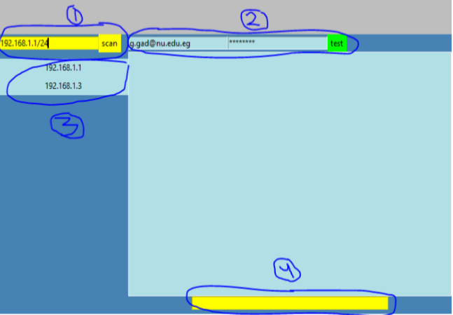
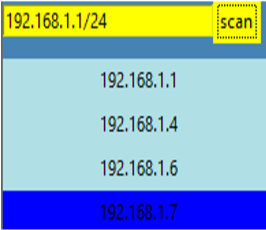
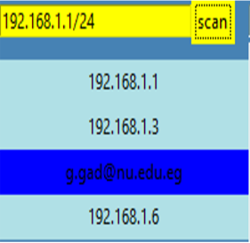

# Hyper-P2P-LAN-communication-application

## ABSTRACT

In LAN networks we don't need internet to reach each, we can communicate with higher speeds. A hybrid communication application on LAN is described and implemented. In hybrid application, clients are not only independent from server's central authority, but they can also depend each other to acquire services in case they can't afford to obtain it themselves.
 This is useful for devices that are connected on a local network where high-speed communication is possible without the need for internet access.

## Key features

1. **Cross platform**:  this application can work on any platform that supports socket programming even if the libraries and dependencies needed for running the services provided are all lost. This application was built neither to fully depend on a server nor to fully depend on self, but to integrate both architectures to gain their combined benefits.
2. **Messaging and file sharing**: LAN networks allow for much higher speed and less congestion than provided by a traditional internet-based communication application.
3. **Graphical user interface**: the GUI used is a one window GUI that is easy to deal with.
4. **Authentication**: although this is a serverless application which will not allow for a shared database for user accounts, users still have the option to authenticate their identities using the enterprise or university email.
5. **Security**: all messages sent are encrypted.

> **some features need improvements. Your questions and contributions are welcomed**

## Design and implementation decisions

1. **Python 2.7** is used as the programming language since it provides useful libraries that make implementation faster and sometimes because these provide functionalities that’re not available in other languages libraries, in my knowledge, as free or opensource.
2. **Tkinter** library is used as the GUI library, although this library provide a very simple process to build pretty complex GUI, it caused some problems in the first stages of the project when I used more than one window simultaneously, and after some searching, I found that this library is thread-unsafe which means that the GUI mainloop which listens for all events triggered by button presses, timers, text entries, … must be run in the main thread only. Which led to the decision to put the whole application in one window organized in many frames to avoid the need for handling the GUI from different threads. Other threads are available as well, but they don’t interact with the GUI directly, but through the main thread.
3. Two ports were used, **port 35000** for actual communication between users and **port 7070** as an out-of-band port for implicit communication between each user for information gathering and sharing.

## Process flow

.

The image above shows the application and, as mentioned earlier, it’s only one window that controls everything. Four parts are marked for further discussions.

1. This is a text entry widget and a button; the user enters a subnet and hits the “scan” button to iterate on all IPs in this subnet.
Using ARP (address resolution protocol) ,which is mainly used in 3rd layer switches to translate between MAC addresses of devices and their IPs, the application asks for the MAC address for each IP, if there is a reply then the device is marked as “found” and the MAC address sent to us from this device is neglected since we’re not using ARP for its intended purpose, otherwise, the device is marked as “not found”. After that comes the port scanning part, the application tries to connect to all the “found” devices on ports 7070 and 35000, if the connection is successfully established then this device uses our application and thus marked as a “user”, otherwise, it’s a device that doesn’t use our application. As Fig. 2 shows, devices that are marked as “user” are shown in a blue color while devices that’re not using this application are shown in powder blue color to allow the user of the application to differentiate between devices which he can communicate with and others which he can’t.
2. this part shows two text entries and a button, the user will write his .edu credentials and press the “test” button to authenticate his device. This request is sent to “Microsoft outlook API”.

3. this part shows the scan results frame. If any of the “user” devices which appears in the frame authenticated himself, the next time scanning will show the name of the user instead of the IP.
This is like how DNS works, for example, instead of the user having to remember the IP address of Google’s server, he types google.com and this will be converted, using a DNS server to the IP of the Google’s server. Here too, the user can find his authenticated colleagues by their names instead of guessing or asking them about their IP, which will be more painful than remembering Google’s IP since IP’s in LAN networks usually are assigned by a DHCP server and thus changes continuously.
Also, the IPs and names appearing in the scan results frame are buttons, so the user can press any “user” device (whether it’s a name or an IP) and a connection will be established on port 35000 between him and that device.

4. This part shows a text entry where the user can type in a message and press “enter” key to send it to the device he has connected to.

